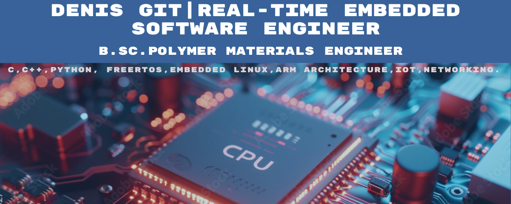

# 👋 Hi, I'm Denis

## 🚀 About Me
- 🌱 Currently transitioning to embedded software development.
I'm a proactive Embedded Software Developer with a background in Materials Engineering and over four years of experience in solving technical challenges and delivering innovative solutions.
My journey into embedded systems was fueled by a passion for understanding complex systems and creative problem-solving. 
I specialize in real-time operating systems (RTOS), ARM processor architecture, and programming in C, C++, and Python.

📌 Key Highlights:

Integrated Jetson Orin Nano with Holybro X650 for real-time image processing.
Designed advanced SLS printing technology, reducing production time for UAV components by 35%.
Skilled in FreeRTOS, STM32, and AI-driven embedded systems.
🚀 I'm excited about leveraging my skills to push the boundaries of embedded solutions and create impactful technology.

## 

## 📊 GitHub Stats

## 🛠️ Skills
- Embedded Systems, C, Python, Linux
- Arduino, IoT, Real-Time Systems

## 📂 Projects
| Project Name | Description |
|--------------|-------------|
| [Project 1](#) | A cool project description here. |

## 🎨 Let's Connect

